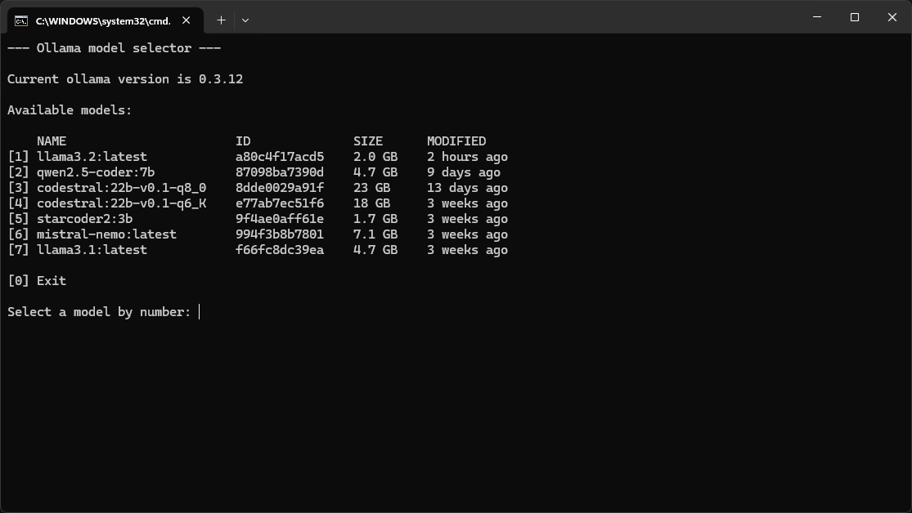

# Ollama model selection script for Windows
 
Simple batch script that iwll let you select any Ollama model using the CLI. 

Useful if you want to query from the command line and don't want to remember model names.

It will execute Ollama app if not yet running.

Tested on Windows 11.

